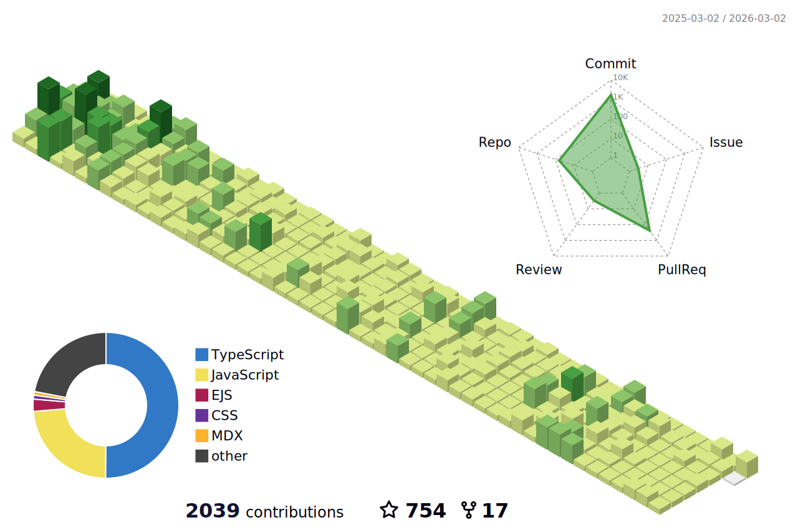

[](https://hunghg255.github.io)
<!-- [](https://hunghg255.github.io) -->
<!-- # 👀 Hi stranger! 👋🏻 -->

<h1 align='center'>< Hi there, I'm Hung /> 👋✌🏻</h1>

<h2 align='center'>Languages and Tools 🔧🏋</h2>

<div align='center'>
  
  
  
  
  
  
  
  
  
  
  
  
  
  
  
  
  
  
  
  
  
</div>

<h2 align='center'> 📈 Github Stars </h2>
<p align="center"> 
  
  
  
</p>
<div align="center">
 
  
  
  <h2 align='center'> 📈 Contributions in this year </h2>

  
  
  
  <h2 align='center'> 🏆 Github Profile Trophy</h2>
  
  
</div>


<h2 align='center'> 📈 Code Activity Wakatime </h2>

<!--START_SECTION:waka-->


**I'm an Early 🐤** 

```text
🌞 Morning                131 commits         ███████░░░░░░░░░░░░░░░░░░   28.05 % 
🌆 Daytime                146 commits         ████████░░░░░░░░░░░░░░░░░   31.26 % 
🌃 Evening                99 commits          █████░░░░░░░░░░░░░░░░░░░░   21.20 % 
🌙 Night                  91 commits          █████░░░░░░░░░░░░░░░░░░░░   19.49 % 
```
📅 **I'm Most Productive on Thursday** 

```text
Monday                   55 commits          ███░░░░░░░░░░░░░░░░░░░░░░   11.78 % 
Tuesday                  71 commits          ████░░░░░░░░░░░░░░░░░░░░░   15.20 % 
Wednesday                64 commits          ███░░░░░░░░░░░░░░░░░░░░░░   13.70 % 
Thursday                 103 commits         ██████░░░░░░░░░░░░░░░░░░░   22.06 % 
Friday                   71 commits          ████░░░░░░░░░░░░░░░░░░░░░   15.20 % 
Saturday                 52 commits          ███░░░░░░░░░░░░░░░░░░░░░░   11.13 % 
Sunday                   51 commits          ███░░░░░░░░░░░░░░░░░░░░░░   10.92 % 
```


📊 **This Week I Spent My Time On** 

```text
💬 Programming Languages: 
JavaScript               30 hrs 6 mins       ████████████████░░░░░░░░░   63.43 % 
TypeScript               8 hrs 27 mins       ████░░░░░░░░░░░░░░░░░░░░░   17.83 % 
SCSS                     2 hrs 57 mins       ██░░░░░░░░░░░░░░░░░░░░░░░   06.23 % 
PHP                      1 hr 22 mins        █░░░░░░░░░░░░░░░░░░░░░░░░   02.90 % 
JSON                     1 hr 22 mins        █░░░░░░░░░░░░░░░░░░░░░░░░   02.89 % 

🔥 Editors: 
VS Code                  47 hrs 27 mins      █████████████████████████   100.00 % 
```


 Last Updated on 24/02/2023 18:43:58 UTC
<!--END_SECTION:waka-->

