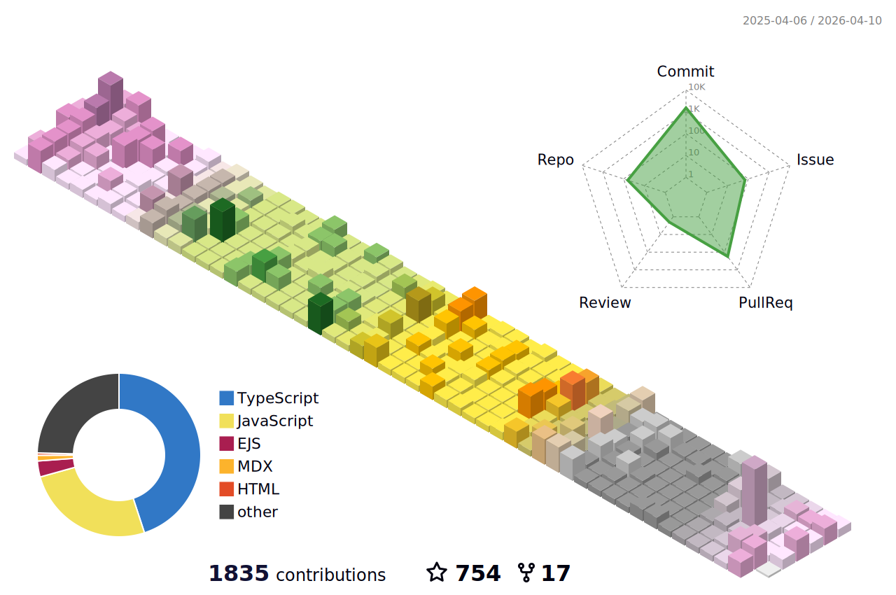

<div align="center">
<!--   <a href="https://hung.thedev.id/">
    
  </a>
  <br> -->
  <samp>Hi, I'm Hung, Frontend developer from Hanoi, Vietnam.</samp>

<p align="center">
  <samp>
    <span>learning</span> .
    <a href="https://hung.thedev.id">me</a> .
    <a href="https://web-totals.vercel.app/blog">blog</a> .
    <a href="https://hunghg-resume.vercel.app/">resume</a> .
    <a href="https://toolsfe.vercel.app/tools/index.html">projects</a> .
    <a href="https://twitter.com/hunghg255">tweets</a> .
    <a href="https://hunghg-contact.vercel.app/">contacts</a>
    <br />
    <a href="mailto:giahung197bg@gmail.com">mail</a> .
    <a href="https://gist.github.com/hunghg255">gist</a> .
    <a href="https://github.com/hunghg255/use">use</a>
  </samp>
</p>

  <br>
  <br>
</div>

<h2 align='center'>💖 Sponsor</h2>

If my code has been helpful to you, kindly consider [sponsoring me](https://github.com/sponsors/hunghg255).

- [GitHub Sponsor](https://github.com/sponsors/hunghg255)

<p align="center">
  <a href="https://raw.githubusercontent.com/hunghg255/sponsors/main/sponsors.svg">
    
  </a>
</p>

<h2 align='center'>📖 Latest blog posts</h2>

<!-- start-blog-posts -->
- [React Provider Hell](https://web-totals.vercel.app/blog/react-provider-hell) - `Tue, 19 Sep 2023 19:28:57 GMT`
- [Example Callstack And Event loop](https://web-totals.vercel.app/blog/event-loop-call-stack-example) - `Tue, 05 Sep 2023 04:54:37 GMT`
- [Centering in CSS](https://web-totals.vercel.app/blog/center-css) - `Fri, 12 May 2023 04:20:35 GMT`
- [Vscode extensions useful](https://web-totals.vercel.app/blog/vscode-extensions-useful) - `Mon, 24 Apr 2023 17:21:54 GMT`
- [Convert svgs file to jsx by one script](https://web-totals.vercel.app/blog/convert-svgs-to-jsx) - `Mon, 24 Apr 2023 17:13:15 GMT`
- [HTML Input Type](https://web-totals.vercel.app/blog/html-input) - `Thu, 13 Apr 2023 10:15:25 GMT`
<!-- end-blog-posts -->

<h2 align='center'>💖 Repositories </h2>

<details>
<summary>More Repositories ...</summary>

<!-- start-projects -->

<h2 align='center'>Rsbuild Plugin</h2>

<table>
  <thead align="center">
    <tr>
      <th>Handbook</th>
<th>Github</th>
<th>Npm</th>
<th>Stars</th>
<th>Last Commit</th>
<th>Download</th>
<th>Version</th>
    </tr>
  </thead>
  <tbody align="left">
  <tr>
      <th>
        rsbuild-plugin-print
      </th>
      <th>
        <a href="https://github.com/hunghg255/rsbuild-plugin-print" target="_blank">#Github</a>
      </th>
      <th>
        <a href="https://www.npmjs.com/package/rsbuild-plugin-print" target="_blank">#Npm</a>
      </th>
      <th>
        
      </th>
      <th>
        
      </th>
      <th>
        
      </th>
      <th>
        
      </th>
    </tr>
<tr>
      <th>
        rsbuild-plugin-console-debug
      </th>
      <th>
        <a href="https://github.com/hunghg255/rsbuild-plugin-console-debug" target="_blank">#Github</a>
      </th>
      <th>
        <a href="https://www.npmjs.com/package/rsbuild-plugin-console-debug" target="_blank">#Npm</a>
      </th>
      <th>
        
      </th>
      <th>
        
      </th>
      <th>
        
      </th>
      <th>
        
      </th>
    </tr>
  </tbody>
</table>
      

<h2 align='center'>Vite Plugin</h2>

<table>
  <thead align="center">
    <tr>
      <th>Handbook</th>
<th>Github</th>
<th>Npm</th>
<th>Stars</th>
<th>Last Commit</th>
<th>Download</th>
<th>Version</th>
    </tr>
  </thead>
  <tbody align="left">
  <tr>
      <th>
        vite-host-qrcode
      </th>
      <th>
        <a href="https://github.com/hunghg255/vite-host-qrcode" target="_blank">#Github</a>
      </th>
      <th>
        <a href="https://www.npmjs.com/package/vite-host-qrcode" target="_blank">#Npm</a>
      </th>
      <th>
        
      </th>
      <th>
        
      </th>
      <th>
        
      </th>
      <th>
        
      </th>
    </tr>
<tr>
      <th>
        vite-plugin-resize-image
      </th>
      <th>
        <a href="https://github.com/hunghg255/vite-plugin-resize-image" target="_blank">#Github</a>
      </th>
      <th>
        <a href="https://www.npmjs.com/package/vite-plugin-resize-image" target="_blank">#Npm</a>
      </th>
      <th>
        
      </th>
      <th>
        
      </th>
      <th>
        
      </th>
      <th>
        
      </th>
    </tr>
<tr>
      <th>
        vite-minify-css-module
      </th>
      <th>
        <a href="https://github.com/hunghg255/vite-minify-css-module" target="_blank">#Github</a>
      </th>
      <th>
        <a href="https://www.npmjs.com/package/vite-minify-css-module" target="_blank">#Npm</a>
      </th>
      <th>
        
      </th>
      <th>
        
      </th>
      <th>
        
      </th>
      <th>
        
      </th>
    </tr>
<tr>
      <th>
        vite-console-debug
      </th>
      <th>
        <a href="https://github.com/hunghg255/vite-console-debug" target="_blank">#Github</a>
      </th>
      <th>
        <a href="https://www.npmjs.com/package/vite-console-debug" target="_blank">#Npm</a>
      </th>
      <th>
        
      </th>
      <th>
        
      </th>
      <th>
        
      </th>
      <th>
        
      </th>
    </tr>
  </tbody>
</table>
      

<h2 align='center'>💼 Node - Script</h2>

<table>
  <thead align="center">
    <tr>
      <th>Handbook</th>
<th>Github</th>
<th>Npm</th>
<th>Stars</th>
<th>Last Commit</th>
<th>Download</th>
<th>Version</th>
    </tr>
  </thead>
  <tbody align="left">
  <tr>
      <th>
        create-template-fe
      </th>
      <th>
        <a href="https://github.com/hunghg255/create-template-fe" target="_blank">#Github</a>
      </th>
      <th>
        <a href="https://www.npmjs.com/package/create-template-fe" target="_blank">#Npm</a>
      </th>
      <th>
        
      </th>
      <th>
        
      </th>
      <th>
        
      </th>
      <th>
        
      </th>
    </tr>
<tr>
      <th>
        bumpp-version
      </th>
      <th>
        <a href="https://github.com/hunghg255/bumpp-version" target="_blank">#Github</a>
      </th>
      <th>
        <a href="https://www.npmjs.com/package/bumpp-version" target="_blank">#Npm</a>
      </th>
      <th>
        
      </th>
      <th>
        
      </th>
      <th>
        
      </th>
      <th>
        
      </th>
    </tr>
<tr>
      <th>
        ctun
      </th>
      <th>
        <a href="https://github.com/hunghg255/ctun" target="_blank">#Github</a>
      </th>
      <th>
        <a href="https://www.npmjs.com/package/ctun" target="_blank">#Npm</a>
      </th>
      <th>
        
      </th>
      <th>
        
      </th>
      <th>
        
      </th>
      <th>
        
      </th>
    </tr>
<tr>
      <th>
        verify-commit-msg
      </th>
      <th>
        <a href="https://github.com/hunghg255/verify-commit-msg" target="_blank">#Github</a>
      </th>
      <th>
        <a href="https://www.npmjs.com/package/verify-commit-msg" target="_blank">#Npm</a>
      </th>
      <th>
        
      </th>
      <th>
        
      </th>
      <th>
        
      </th>
      <th>
        
      </th>
    </tr>
<tr>
      <th>
        changeloggithub
      </th>
      <th>
        <a href="https://github.com/hunghg255/changeloggithub" target="_blank">#Github</a>
      </th>
      <th>
        <a href="https://www.npmjs.com/package/changeloggithub" target="_blank">#Npm</a>
      </th>
      <th>
        
      </th>
      <th>
        
      </th>
      <th>
        
      </th>
      <th>
        
      </th>
    </tr>
<tr>
      <th>
        git-scm-hooks
      </th>
      <th>
        <a href="https://github.com/hunghg255/git-scm-hooks" target="_blank">#Github</a>
      </th>
      <th>
        <a href="https://www.npmjs.com/package/git-scm-hooks" target="_blank">#Npm</a>
      </th>
      <th>
        
      </th>
      <th>
        
      </th>
      <th>
        
      </th>
      <th>
        
      </th>
    </tr>
<tr>
      <th>
        ungradient
      </th>
      <th>
        <a href="https://github.com/hunghg255/ungradient" target="_blank">#Github</a>
      </th>
      <th>
        <a href="https://www.npmjs.com/package/ungradient" target="_blank">#Npm</a>
      </th>
      <th>
        
      </th>
      <th>
        
      </th>
      <th>
        
      </th>
      <th>
        
      </th>
    </tr>
<tr>
      <th>
        csvs-parsers
      </th>
      <th>
        <a href="https://github.com/hunghg255/csvs-parsers" target="_blank">#Github</a>
      </th>
      <th>
        <a href="https://www.npmjs.com/package/csvs-parsers" target="_blank">#Npm</a>
      </th>
      <th>
        
      </th>
      <th>
        
      </th>
      <th>
        
      </th>
      <th>
        
      </th>
    </tr>
<tr>
      <th>
        music-lyrics
      </th>
      <th>
        <a href="https://github.com/hunghg255/music-lyrics" target="_blank">#Github</a>
      </th>
      <th>
        <a href="https://www.npmjs.com/package/@hunghg255/music-lyrics" target="_blank">#Npm</a>
      </th>
      <th>
        
      </th>
      <th>
        
      </th>
      <th>
        
      </th>
      <th>
        
      </th>
    </tr>
<tr>
      <th>
        unreadconfig
      </th>
      <th>
        <a href="https://github.com/hunghg255/unreadconfig" target="_blank">#Github</a>
      </th>
      <th>
        <a href="https://www.npmjs.com/package/unreadconfig" target="_blank">#Npm</a>
      </th>
      <th>
        
      </th>
      <th>
        
      </th>
      <th>
        
      </th>
      <th>
        
      </th>
    </tr>
<tr>
      <th>
        vn-qr-pay
      </th>
      <th>
        <a href="https://github.com/hunghg255/vn-qr-pay" target="_blank">#Github</a>
      </th>
      <th>
        <a href="https://www.npmjs.com/package/vn-qr-pay" target="_blank">#Npm</a>
      </th>
      <th>
        
      </th>
      <th>
        
      </th>
      <th>
        
      </th>
      <th>
        
      </th>
    </tr>
  </tbody>
</table>
      

<h2 align='center'>💼 Frontend</h2>

<table>
  <thead align="center">
    <tr>
      <th>Handbook</th>
<th>Github</th>
<th>Npm</th>
<th>Stars</th>
<th>Last Commit</th>
<th>Download</th>
<th>Version</th>
    </tr>
  </thead>
  <tbody align="left">
  <tr>
      <th>
        window-onscroll
      </th>
      <th>
        <a href="https://github.com/hunghg255/window-onscroll" target="_blank">#Github</a>
      </th>
      <th>
        <a href="https://www.npmjs.com/package/window-onscroll" target="_blank">#Npm</a>
      </th>
      <th>
        
      </th>
      <th>
        
      </th>
      <th>
        
      </th>
      <th>
        
      </th>
    </tr>
<tr>
      <th>
        generate-video-thumbnail
      </th>
      <th>
        <a href="https://github.com/hunghg255/generate-video-thumbnail" target="_blank">#Github</a>
      </th>
      <th>
        <a href="https://www.npmjs.com/package/generate-video-thumbnail" target="_blank">#Npm</a>
      </th>
      <th>
        
      </th>
      <th>
        
      </th>
      <th>
        
      </th>
      <th>
        
      </th>
    </tr>
<tr>
      <th>
        toastjs-tiny
      </th>
      <th>
        <a href="https://github.com/hunghg255/toast" target="_blank">#Github</a>
      </th>
      <th>
        <a href="https://www.npmjs.com/package/toastjs-tiny" target="_blank">#Npm</a>
      </th>
      <th>
        
      </th>
      <th>
        
      </th>
      <th>
        
      </th>
      <th>
        
      </th>
    </tr>
<tr>
      <th>
        mega-menu-aim
      </th>
      <th>
        <a href="https://github.com/hunghg255/menu-mega-aim" target="_blank">#Github</a>
      </th>
      <th>
        <a href="https://www.npmjs.com/package/mega-menu-aim" target="_blank">#Npm</a>
      </th>
      <th>
        
      </th>
      <th>
        
      </th>
      <th>
        
      </th>
      <th>
        
      </th>
    </tr>
<tr>
      <th>
        introh-js
      </th>
      <th>
        <a href="https://github.com/hunghg255/intro-js" target="_blank">#Github</a>
      </th>
      <th>
        <a href="https://www.npmjs.com/package/introh-js" target="_blank">#Npm</a>
      </th>
      <th>
        
      </th>
      <th>
        
      </th>
      <th>
        
      </th>
      <th>
        
      </th>
    </tr>
<tr>
      <th>
        number-2-text-vietnamese
      </th>
      <th>
        <a href="https://github.com/hunghg255/number-2-text-vietnamese" target="_blank">#Github</a>
      </th>
      <th>
        <a href="https://www.npmjs.com/package/number-2-text-vietnamese" target="_blank">#Npm</a>
      </th>
      <th>
        
      </th>
      <th>
        
      </th>
      <th>
        
      </th>
      <th>
        
      </th>
    </tr>
<tr>
      <th>
        fast-react-context
      </th>
      <th>
        <a href="https://github.com/hunghg255/fast-react-context" target="_blank">#Github</a>
      </th>
      <th>
        <a href="https://www.npmjs.com/package/fast-react-context" target="_blank">#Npm</a>
      </th>
      <th>
        
      </th>
      <th>
        
      </th>
      <th>
        
      </th>
      <th>
        
      </th>
    </tr>
<tr>
      <th>
        svg-to-jsx
      </th>
      <th>
        <a href="https://github.com/hunghg255/svg-to-jsx" target="_blank">#Github</a>
      </th>
      <th>
        <a href="https://www.npmjs.com/package/agile-svg2jsx" target="_blank">#Npm</a>
      </th>
      <th>
        
      </th>
      <th>
        
      </th>
      <th>
        
      </th>
      <th>
        
      </th>
    </tr>
<tr>
      <th>
        csvg-to-font
      </th>
      <th>
        <a href="https://github.com/hunghg255/svg-to-font" target="_blank">#Github</a>
      </th>
      <th>
        <a href="https://www.npmjs.com/package/csvg-to-font" target="_blank">#Npm</a>
      </th>
      <th>
        
      </th>
      <th>
        
      </th>
      <th>
        
      </th>
      <th>
        
      </th>
    </tr>
<tr>
      <th>
        react-gh-corners
      </th>
      <th>
        <a href="https://github.com/hunghg255/react-github-corners" target="_blank">#Github</a>
      </th>
      <th>
        <a href="https://www.npmjs.com/package/react-gh-corners" target="_blank">#Npm</a>
      </th>
      <th>
        
      </th>
      <th>
        
      </th>
      <th>
        
      </th>
      <th>
        
      </th>
    </tr>
<tr>
      <th>
        jotai-tiny
      </th>
      <th>
        <a href="https://github.com/hunghg255/jotai-tiny" target="_blank">#Github</a>
      </th>
      <th>
        <a href="https://www.npmjs.com/package/jotai-tiny" target="_blank">#Npm</a>
      </th>
      <th>
        
      </th>
      <th>
        
      </th>
      <th>
        
      </th>
      <th>
        
      </th>
    </tr>
<tr>
      <th>
        css2tailwind
      </th>
      <th>
        <a href="https://github.com/hunghg255/css2tailwind" target="_blank">#Github</a>
      </th>
      <th>
        <a href="https://www.npmjs.com/package/css2tailwind" target="_blank">#Npm</a>
      </th>
      <th>
        
      </th>
      <th>
        
      </th>
      <th>
        
      </th>
      <th>
        
      </th>
    </tr>
<tr>
      <th>
        reactjs-otp-input
      </th>
      <th>
        <a href="https://github.com/hunghg255/reactjs-otp-input" target="_blank">#Github</a>
      </th>
      <th>
        <a href="https://www.npmjs.com/package/reactjs-otp-input" target="_blank">#Npm</a>
      </th>
      <th>
        
      </th>
      <th>
        
      </th>
      <th>
        
      </th>
      <th>
        
      </th>
    </tr>
<tr>
      <th>
        quill-resize-image
      </th>
      <th>
        <a href="https://github.com/hunghg255/quill-resize-image" target="_blank">#Github</a>
      </th>
      <th>
        <a href="https://www.npmjs.com/package/quill-resize-image" target="_blank">#Npm</a>
      </th>
      <th>
        
      </th>
      <th>
        
      </th>
      <th>
        
      </th>
      <th>
        
      </th>
    </tr>
<tr>
      <th>
        uninspect
      </th>
      <th>
        <a href="https://github.com/hunghg255/uninspect" target="_blank">#Github</a>
      </th>
      <th>
        <a href="https://www.npmjs.com/package/uninspect" target="_blank">#Npm</a>
      </th>
      <th>
        
      </th>
      <th>
        
      </th>
      <th>
        
      </th>
      <th>
        
      </th>
    </tr>
<tr>
      <th>
        uncolur
      </th>
      <th>
        <a href="https://github.com/hunghg255/uncolur" target="_blank">#Github</a>
      </th>
      <th>
        <a href="https://www.npmjs.com/package/uncolur" target="_blank">#Npm</a>
      </th>
      <th>
        
      </th>
      <th>
        
      </th>
      <th>
        
      </th>
      <th>
        
      </th>
    </tr>
<tr>
      <th>
        sveltejs-jotai
      </th>
      <th>
        <a href="https://github.com/hunghg255/sveltejs-jotai" target="_blank">#Github</a>
      </th>
      <th>
        <a href="https://www.npmjs.com/package/sveltejs-jotai" target="_blank">#Npm</a>
      </th>
      <th>
        
      </th>
      <th>
        
      </th>
      <th>
        
      </th>
      <th>
        
      </th>
    </tr>
<tr>
      <th>
        sveltejs-valtio
      </th>
      <th>
        <a href="https://github.com/hunghg255/sveltejs-valtio" target="_blank">#Github</a>
      </th>
      <th>
        <a href="https://www.npmjs.com/package/sveltejs-valtio" target="_blank">#Npm</a>
      </th>
      <th>
        
      </th>
      <th>
        
      </th>
      <th>
        
      </th>
      <th>
        
      </th>
    </tr>
<tr>
      <th>
        uncookie
      </th>
      <th>
        <a href="https://github.com/hunghg255/uncookie" target="_blank">#Github</a>
      </th>
      <th>
        <a href="https://www.npmjs.com/package/uncookie" target="_blank">#Npm</a>
      </th>
      <th>
        
      </th>
      <th>
        
      </th>
      <th>
        
      </th>
      <th>
        
      </th>
    </tr>
<tr>
      <th>
        dom-to-images
      </th>
      <th>
        <a href="https://github.com/hunghg255/dom-to-images" target="_blank">#Github</a>
      </th>
      <th>
        <a href="https://www.npmjs.com/package/dom-to-images" target="_blank">#Npm</a>
      </th>
      <th>
        
      </th>
      <th>
        
      </th>
      <th>
        
      </th>
      <th>
        
      </th>
    </tr>
<tr>
      <th>
        hqr
      </th>
      <th>
        <a href="https://github.com/hunghg255/hqr" target="_blank">#Github</a>
      </th>
      <th>
        <a href="https://www.npmjs.com/package/hqr" target="_blank">#Npm</a>
      </th>
      <th>
        
      </th>
      <th>
        
      </th>
      <th>
        
      </th>
      <th>
        
      </th>
    </tr>
<tr>
      <th>
        react-sticky
      </th>
      <th>
        <a href="https://github.com/hunghg255/reactjs-s4y" target="_blank">#Github</a>
      </th>
      <th>
        <a href="https://www.npmjs.com/package/reactjs-s4y" target="_blank">#Npm</a>
      </th>
      <th>
        
      </th>
      <th>
        
      </th>
      <th>
        
      </th>
      <th>
        
      </th>
    </tr>
  </tbody>
</table>
      

<h2 align='center'>💼 Extensions</h2>

<table>
  <thead align="center">
    <tr>
      <th>Handbook</th>
<th>Github</th>
<th>Marketplace</th>
<th>Stars</th>
<th>Last Commit</th>
<th>Download</th>
<th>Version</th>
    </tr>
  </thead>
  <tbody align="left">
  <tr>
      <th>
        agile-css-suggestion
      </th>
      <th>
        <a href="https://github.com/hunghg255/agile-css-suggestion" target="_blank">#Github</a>
      </th>
      <th>
        <a href="https://marketplace.visualstudio.com/items?itemName=AgileCssSuggestion.agile-css-suggestion" target="_blank">#Marketplace</a>
      </th>
      <th>
        
      </th>
      <th>
        
      </th>
      <th>
        
      </th>
      <th>
        
      </th>
    </tr>
<tr>
      <th>
        css-to-tailwindcss-extension
      </th>
      <th>
        <a href="https://github.com/hunghg255/css-to-tailwindcss-extension" target="_blank">#Github</a>
      </th>
      <th>
        <a href="https://marketplace.visualstudio.com/items?itemName=hunghg255.css-2-tailwindcss" target="_blank">#Marketplace</a>
      </th>
      <th>
        
      </th>
      <th>
        
      </th>
      <th>
        
      </th>
      <th>
        
      </th>
    </tr>
  </tbody>
</table>
      

<h2 align='center'>💼 Github Actions</h2>

<table>
  <thead align="center">
    <tr>
      <th>Handbook</th>
<th>Github</th>
<th>Marketplace</th>
<th>Stars</th>
<th>Last Commit</th>
<th>Download</th>
<th>Version</th>
    </tr>
  </thead>
  <tbody align="left">
  <tr>
      <th>
        action-notifications
      </th>
      <th>
        <a href="https://github.com/hunghg255/action-notifications" target="_blank">#Github</a>
      </th>
      <th>
        <a href="https://github.com/marketplace/actions/github-action-notification" target="_blank">#Marketplace</a>
      </th>
      <th>
        
      </th>
      <th>
        
      </th>
      <th>
        
      </th>
      <th>
        
      </th>
    </tr>
<tr>
      <th>
        surge-preview
      </th>
      <th>
        <a href="https://github.com/hunghg255/surge-preview" target="_blank">#Github</a>
      </th>
      <th>
        <a href="https://github.com/hunghg255/surge-preview" target="_blank">#Marketplace</a>
      </th>
      <th>
        
      </th>
      <th>
        
      </th>
      <th>
        
      </th>
      <th>
        
      </th>
    </tr>
  </tbody>
</table>
      

<h2 align='center'>💼 Devtools</h2>

<table>
  <thead align="center">
    <tr>
      <th>Handbook</th>
<th>Github</th>
<th>Npm</th>
<th>Stars</th>
<th>Last Commit</th>
<th>Download</th>
<th>Version</th>
    </tr>
  </thead>
  <tbody align="left">
  <tr>
      <th>
        rc-form-devtools
      </th>
      <th>
        <a href="https://github.com/hunghg255/rc-form-devtools" target="_blank">#Github</a>
      </th>
      <th>
        <a href="https://github.com/hunghg255/rc-form-devtools" target="_blank">#Npm</a>
      </th>
      <th>
        
      </th>
      <th>
        
      </th>
      <th>
        
      </th>
      <th>
        
      </th>
    </tr>
  </tbody>
</table>
      
<!-- end-projects -->

<h2 align='center'>💼 Bots</h2>

<table>
  <thead align="center">
    <tr>
      <th>Name</th>
      <th>Application</th>
      <th>Invite Link</th>
      <th>Commands Docs</th>
      <th>Technology</th>
    </tr>
  </thead>
  <tbody align="left">
    <tr>
      <th>
        Music Bot
      </th>
      <th>
        Discord
      </th>
      <th>
        <a href="https://discord.com/api/oauth2/authorize?client_id=1000354375409086484&permissions=274915121472&scope=bot" target="_blank">Invite</a>
      </th>
      <th>
        <a href="https://music1-bot.vercel.app/" target="_blank">Commands</a>
      </th>
      <th>
        
      </th>
    </tr>
   </tbody>
</table>

</details>


[**CSS to tailwindcss Extension**](https://github.com/hunghg255/css-to-tailwindcss-extension) •
[surge-preview](https://github.com/hunghg255/surge-preview) •
[action-notifications](https://github.com/hunghg255/action-notifications) •
[quill-resize-image](https://github.com/hunghg255/quill-resize-image) •
[github-rank](https://hunghg255.github.io/github-rank/users.vietnam.html) •


<div align="center">
<!--  
  
   -->

  <h2 align='center'> 📈 Contributions in this year </h2>




  <h2 align='center'> 🏆 Github Profile Trophy</h2>


</div>

<h2 align='center'> 📈 Code Activity Wakatime </h2>

<!--START_SECTION:waka-->


**I'm an Early 🐤** 

```text
🌞 Morning                7651 commits        ██████░░░░░░░░░░░░░░░░░░░   22.75 % 
🌆 Daytime                15541 commits       ████████████░░░░░░░░░░░░░   46.22 % 
🌃 Evening                8310 commits        ██████░░░░░░░░░░░░░░░░░░░   24.71 % 
🌙 Night                  2124 commits        ██░░░░░░░░░░░░░░░░░░░░░░░   06.32 % 
```
📅 **I'm Most Productive on Thursday** 

```text
Monday                   4820 commits        ████░░░░░░░░░░░░░░░░░░░░░   14.33 % 
Tuesday                  6390 commits        █████░░░░░░░░░░░░░░░░░░░░   19.00 % 
Wednesday                5360 commits        ████░░░░░░░░░░░░░░░░░░░░░   15.94 % 
Thursday                 9585 commits        ███████░░░░░░░░░░░░░░░░░░   28.50 % 
Friday                   5998 commits        ████░░░░░░░░░░░░░░░░░░░░░   17.84 % 
Saturday                 951 commits         █░░░░░░░░░░░░░░░░░░░░░░░░   02.83 % 
Sunday                   522 commits         ░░░░░░░░░░░░░░░░░░░░░░░░░   01.55 % 
```


📊 **This Week I Spent My Time On** 

```text
💬 Programming Languages: 
TypeScript               24 hrs 45 mins      ████████████████░░░░░░░░░   63.49 % 
JSON                     4 hrs 28 mins       ███░░░░░░░░░░░░░░░░░░░░░░   11.46 % 
Groovy                   2 hrs 59 mins       ██░░░░░░░░░░░░░░░░░░░░░░░   07.67 % 
SCSS                     2 hrs 47 mins       ██░░░░░░░░░░░░░░░░░░░░░░░   07.17 % 
Other                    1 hr 4 mins         █░░░░░░░░░░░░░░░░░░░░░░░░   02.76 % 

🔥 Editors: 
VS Code                  38 hrs 59 mins      █████████████████████████   100.00 % 
```


 Last Updated on 08/12/2023 04:48:26 UTC
<!--END_SECTION:waka-->
