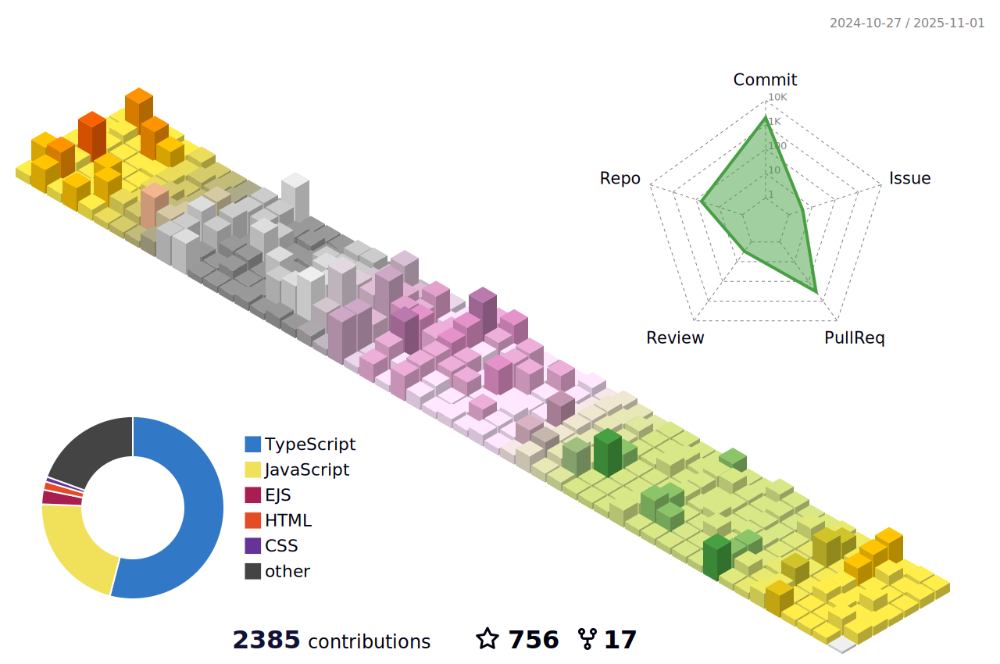

<!-- [](https://hung.thedev.id) -->
<!-- [](https://hung.thedev.id) -->
<!-- # 👀 Hi stranger! 👋🏻 -->

<!-- <h1 align='center'>Hi there, I'm Hung 👋✌🏻</h1>  -->

<p align="center">
  <samp>
    <span>learning</span> .
    <a href="https://hung.thedev.id">me</a> .
    <a href="https://web-totals.vercel.app/blog">blog</a> .
    <a href="https://hunghg-resume.vercel.app/">resume</a> .
    <a href="https://hung.thedev.id/projects">projects</a> .
    <a href="https://twitter.com/hunghg255">tweets</a> .
    <a href="https://hunghg-contact.vercel.app/">contacts</a>
    <br />
    <a href="mailto:giahung197bg@gmail.com">mail</a> .
    <a href="https://gist.github.com/hunghg255">gist</a> .
    <a href="https://github.com/hunghg255/use">use</a>
  </samp>
</p>


<!-- <h2 align='center'>Languages and Tools 🔧🏋</h2>

<div align='center'>
  
  
  
  
  
   
  
  
  
  
  
  
  
  
  
  

  
  
  
  
  
  
  
  

</div> -->

<!-- <p align="center">
  <kbd>
  
  
  
  
  </kbd>
</p> -->

<h2 align='center'>💖 Sponsor</h2>

If my code has been helpful to you, kindly consider [sponsoring me](https://github.com/sponsors/hunghg255).

- [GitHub Sponsor](https://github.com/sponsors/hunghg255) 

<p align="center">
  <a href="https://raw.githubusercontent.com/hunghg255/sponsors/main/sponsors.svg">
    
  </a>
</p>

<h2 align='center'>📖 Latest blog posts</h2>

<!-- start-blog-posts -->
- [React Provider Hell](https://web-totals.vercel.app/blog/react-provider-hell) - `Tue, 19 Sep 2023 19:28:57 GMT`
- [Example Callstack And Event loop](https://web-totals.vercel.app/blog/event-loop-call-stack-example) - `Tue, 05 Sep 2023 04:54:37 GMT`
- [Centering in CSS](https://web-totals.vercel.app/blog/center-css) - `Fri, 12 May 2023 04:20:35 GMT`
- [Vscode extensions useful](https://web-totals.vercel.app/blog/vscode-extensions-useful) - `Mon, 24 Apr 2023 17:21:54 GMT`
- [Convert svgs file to jsx by one script](https://web-totals.vercel.app/blog/convert-svgs-to-jsx) - `Mon, 24 Apr 2023 17:13:15 GMT`
- [HTML Input Type](https://web-totals.vercel.app/blog/html-input) - `Thu, 13 Apr 2023 10:15:25 GMT`
<!-- end-blog-posts -->


<!-- start-projects -->

<h2 align='center'>Rsbuild Plugin</h2>

<table>
  <thead align="center">
    <tr>
      <th>Name</th>
<th>Github</th>
<th>Npm</th>
<th>Summary</th>
<th>Technology</th>
<th>Achievement</th>
    </tr>
  </thead>
  <tbody align="left">
  <tr>
      <th>
        rsbuild-plugin-print
      </th>
      <th>
        <a href="https://github.com/hunghg255/rsbuild-plugin-print" target="_blank">Github</a>
      </th>
      <th>
        <a href="https://www.npmjs.com/package/rsbuild-plugin-print" target="_blank">NPM</a>
      </th>
      <th>Print text, show host with qrcode</th>
      <th>
        
      </th>
      <th>
        

      </th>
    </tr>
  </tbody>
</table>
      

<h2 align='center'>💼 Extensions</h2>

<table>
  <thead align="center">
    <tr>
      <th>Name</th>
<th>Github</th>
<th>Marketplace</th>
<th>Summary</th>
<th>Technology</th>
<th>Achievement</th>
    </tr>
  </thead>
  <tbody align="left">
  <tr>
      <th>
        Agile CSS Suggestion
      </th>
      <th>
        <a href="https://github.com/hunghg255/agile-css-suggestion" target="_blank">Github</a>
      </th>
      <th>
        <a href="https://marketplace.visualstudio.com/items?itemName=AgileCssSuggestion.agile-css-suggestion" target="_blank">Marketplace</a>
      </th>
      <th>Suggest Classname CSS</th>
      <th>
        
      </th>
      <th>
        
      </th>
    </tr>
<tr>
      <th>
        CSS To TailwindCSS
      </th>
      <th>
        <a href="https://github.com/hunghg255/css-to-tailwindcss-extension" target="_blank">Github</a>
      </th>
      <th>
        <a href="https://marketplace.visualstudio.com/items?itemName=hunghg255.css-2-tailwindcss" target="_blank">Marketplace</a>
      </th>
      <th>Convert CSS To TailwindCSS</th>
      <th>
        
      </th>
      <th>
        
      </th>
    </tr>
  </tbody>
</table>
      

<h2 align='center'>💼 Github Actions</h2>

<table>
  <thead align="center">
    <tr>
      <th>Name</th>
<th>Github</th>
<th>Marketplace</th>
<th>Summary</th>
<th>Technology</th>
<th>Achievement</th>
    </tr>
  </thead>
  <tbody align="left">
  <tr>
      <th>
        action-notifications
      </th>
      <th>
        <a href="https://github.com/hunghg255/action-notifications" target="_blank">Github</a>
      </th>
      <th>
        <a href="https://github.com/marketplace/actions/github-action-notification" target="_blank">Marketplace</a>
      </th>
      <th>Action Notification to Discord, Slack, Telegram, Google Chat, Microsoft Teams</th>
      <th>
        
      </th>
      <th>
        
      </th>
    </tr>
<tr>
      <th>
        action-preview-site
      </th>
      <th>
        <a href="https://github.com/hunghg255/surge-preview" target="_blank">Github</a>
      </th>
      <th>
        <a href="https://github.com/hunghg255/surge-preview" target="_blank">Marketplace</a>
      </th>
      <th>Action deploy static site to surge</th>
      <th>
        
      </th>
      <th>
        
      </th>
    </tr>
  </tbody>
</table>
      

<h2 align='center'>💼 Devtools</h2>

<table>
  <thead align="center">
    <tr>
      <th>Name</th>
<th>Github</th>
<th>Npm</th>
<th>Summary</th>
<th>Technology</th>
<th>Achievement</th>
    </tr>
  </thead>
  <tbody align="left">
  <tr>
      <th>
        rc-form-devtools
      </th>
      <th>
        <a href="https://github.com/hunghg255/rc-form-devtools" target="_blank">Github</a>
      </th>
      <th>
        <a href="https://www.npmjs.com/package/rc-form-devtools" target="_blank">NPM</a>
      </th>
      <th>Devtools debug for rc-field-form</th>
      <th>
        
      </th>
      <th>
        
      </th>
    </tr>
  </tbody>
</table>
      
<!-- end-projects -->

<h2 align='center'>💼 Bots</h2>

<table>
  <thead align="center">
    <tr>
      <th>Name</th>
      <th>Application</th>
      <th>Invite Link</th>
      <th>Commands Docs</th>
      <th>Technology</th>
    </tr>
  </thead>
  <tbody align="left">
    <tr>
      <th>
        Music Bot
      </th>
      <th>
        Discord
      </th>
      <th>
        <a href="https://discord.com/api/oauth2/authorize?client_id=1000354375409086484&permissions=274915121472&scope=bot" target="_blank">Invite</a>
      </th>
      <th>
        <a href="https://music1-bot.vercel.app/" target="_blank">Commands</a>
      </th>
      <th>
        
      </th>
    </tr>
   </tbody>
</table>


<div align="center">
<!--  
  
   -->

  <h2 align='center'> 📈 Contributions in this year </h2>

  

  

  <h2 align='center'> 🏆 Github Profile Trophy</h2>

  
</div>


<h2 align='center'> 📈 Code Activity Wakatime </h2>

<!--START_SECTION:waka-->


**I'm an Early 🐤** 

```text
🌞 Morning                6426 commits        █████░░░░░░░░░░░░░░░░░░░░   21.55 % 
🌆 Daytime                13514 commits       ███████████░░░░░░░░░░░░░░   45.31 % 
🌃 Evening                7800 commits        ███████░░░░░░░░░░░░░░░░░░   26.15 % 
🌙 Night                  2084 commits        ██░░░░░░░░░░░░░░░░░░░░░░░   06.99 % 
```
📅 **I'm Most Productive on Thursday** 

```text
Monday                   4271 commits        ████░░░░░░░░░░░░░░░░░░░░░   14.32 % 
Tuesday                  5850 commits        █████░░░░░░░░░░░░░░░░░░░░   19.62 % 
Wednesday                4653 commits        ████░░░░░░░░░░░░░░░░░░░░░   15.60 % 
Thursday                 8503 commits        ███████░░░░░░░░░░░░░░░░░░   28.51 % 
Friday                   5144 commits        ████░░░░░░░░░░░░░░░░░░░░░   17.25 % 
Saturday                 897 commits         █░░░░░░░░░░░░░░░░░░░░░░░░   03.01 % 
Sunday                   506 commits         ░░░░░░░░░░░░░░░░░░░░░░░░░   01.70 % 
```


📊 **This Week I Spent My Time On** 

```text
💬 Programming Languages: 
TypeScript               33 hrs 7 mins       ███████████████████░░░░░░   75.51 % 
JavaScript               4 hrs 46 mins       ███░░░░░░░░░░░░░░░░░░░░░░   10.89 % 
JSON                     2 hrs 5 mins        █░░░░░░░░░░░░░░░░░░░░░░░░   04.78 % 
Other                    45 mins             ░░░░░░░░░░░░░░░░░░░░░░░░░   01.73 % 
Vue.js                   40 mins             ░░░░░░░░░░░░░░░░░░░░░░░░░   01.54 % 

🔥 Editors: 
VS Code                  43 hrs 51 mins      █████████████████████████   100.00 % 
```


 Last Updated on 23/11/2023 18:47:14 UTC
<!--END_SECTION:waka-->

