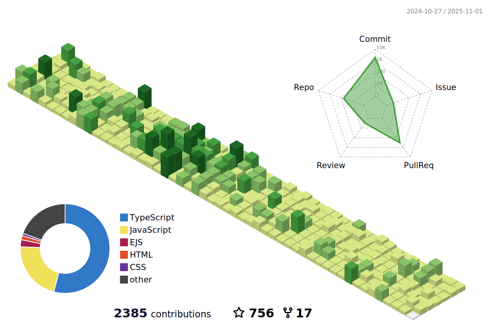

[](https://hung.thedev.id)
<!-- [](https://hung.thedev.id) -->
<!-- # 👀 Hi stranger! 👋🏻 -->

<h1 align='center'>Hi there, I'm Hung 👋✌🏻</h1>

<p align="center">
  <samp>
  Currently, I'm working as frontend developer. You can follow my blog here
    <a href="https://web-totals.vercel.app">Web totals</a>
    ✍️ ✍️ ✍️
  </samp>
</p>


                       
<h2 align='center'>Languages and Tools 🔧🏋</h2>

<div align='center'>
  
  
  
  
  
   
  
  
  
  
  
  
  
  
  
  
  
  
  
  
  
  
  
  
  
  
</div>

<h2 align='center'> 📈 Github Stars & Library NPM & Vscode Extensions</h2>
  
<p align="center"> 
  
  
  
  
</p>
  

  | Libraries	| Downloads |______________ | Vscode Extensions	
  |:----------:|:-------------:|:----------:|:----------:|
  | [create-template-fe](https://www.npmjs.com/package/create-template-fe)	|  | | [Agile CSS Suggestion](https://marketplace.visualstudio.com/items?itemName=AgileCssSuggestion.agile-css-suggestion)
  | [toastjs-tiny](https://www.npmjs.com/package/toastjs-tiny)	|  | | [Agile CSS Autocomplete](https://marketplace.visualstudio.com/items?itemName=AgileCssAutocomplete.agile-css-autocomplete)
  | [mega-menu-aim](https://www.npmjs.com/package/mega-menu-aim)	|  | | 
  | [introh-js](https://www.npmjs.com/package/introh-js)	|  | | 
  | [number-2-text-vietnamese](https://www.npmjs.com/package/number-2-text-vietnamese)	|  | | 
  | [fast-react-context](https://www.npmjs.com/package/fast-react-context)	|  | | 
  | [svg-to-jsx](https://www.npmjs.com/package/agile-svg2jsx)	|  | | 
  | [Atomic-css](https://www.npmjs.com/package/agile-css)	|  | | 
  
  
  
  
<div align="center">
<!--  
  
   -->
  
  <h2 align='center'> 📈 Contributions in this year </h2>

  
  
  
  
  <h2 align='center'> 🏆 Github Profile Trophy</h2>
  
  
</div>


<h2 align='center'> 📈 Code Activity Wakatime </h2>

<!--START_SECTION:waka-->


**I'm an Early 🐤** 

```text
🌞 Morning                308 commits         █████░░░░░░░░░░░░░░░░░░░░   18.17 % 
🌆 Daytime                574 commits         ████████░░░░░░░░░░░░░░░░░   33.86 % 
🌃 Evening                487 commits         ███████░░░░░░░░░░░░░░░░░░   28.73 % 
🌙 Night                  326 commits         █████░░░░░░░░░░░░░░░░░░░░   19.23 % 
```
📅 **I'm Most Productive on Tuesday** 

```text
Monday                   195 commits         ███░░░░░░░░░░░░░░░░░░░░░░   11.50 % 
Tuesday                  349 commits         █████░░░░░░░░░░░░░░░░░░░░   20.59 % 
Wednesday                266 commits         ████░░░░░░░░░░░░░░░░░░░░░   15.69 % 
Thursday                 337 commits         █████░░░░░░░░░░░░░░░░░░░░   19.88 % 
Friday                   210 commits         ███░░░░░░░░░░░░░░░░░░░░░░   12.39 % 
Saturday                 176 commits         ███░░░░░░░░░░░░░░░░░░░░░░   10.38 % 
Sunday                   162 commits         ██░░░░░░░░░░░░░░░░░░░░░░░   09.56 % 
```


📊 **This Week I Spent My Time On** 

```text
💬 Programming Languages: 
TypeScript               27 hrs 13 mins      ██████████████░░░░░░░░░░░   57.02 % 
JavaScript               6 hrs 35 mins       ███░░░░░░░░░░░░░░░░░░░░░░   13.79 % 
JSON                     5 hrs 53 mins       ███░░░░░░░░░░░░░░░░░░░░░░   12.33 % 
CSS                      1 hr 46 mins        █░░░░░░░░░░░░░░░░░░░░░░░░   03.72 % 
Other                    1 hr 32 mins        █░░░░░░░░░░░░░░░░░░░░░░░░   03.24 % 

🔥 Editors: 
VS Code                  47 hrs 44 mins      █████████████████████████   100.00 % 
```


 Last Updated on 27/04/2023 22:46:08 UTC
<!--END_SECTION:waka-->

